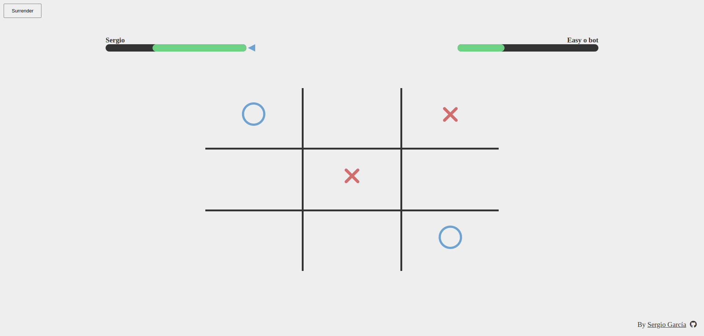

# Tic-Tac-Fight

Tic-Tac-Toe game created with html, css and js

## About the Game

The project is from [The Odin Project](https://www.theodinproject.com/lessons/node-path-javascript-tic-tac-toe) curriculum.

### Features

- Different modes: player vs player // player vs bot // bot vs bot
- Possibility of choose number of lives (= rounds)
- Two types of bots: normal (random) and god (minmax algorithm)
- It's support responsive design

### Tools and technology

- Visual Studio Code
- Linux Terminal
- Font Awesome Icons
- Figma
- Git and GitHub
- HTML and CSS
- JavaScript

### Learnings

- First time using factories and modules
- The algorithm of minmax to create the "god" bot

## Screenshots

### Design in Figma

### Game Screenshots

#### Main menu

#### Game in action

#### Finish menu

#### Responsive

  
   

## Acknowledgements

- Project idea by [The Odin Project](https://www.theodinproject.com/)
- [FreeCodeCamp](https://www.freecodecamp.org/news/how-to-make-your-tic-tac-toe-game-unbeatable-by-using-the-minimax-algorithm-9d690bad4b37/) help a lot to understand minmax algorithm

## Author

[Sergio García](https://github.com/sergiogarciiam)

## License

This project is open source and available under the [MIT License](./LICENSE).
